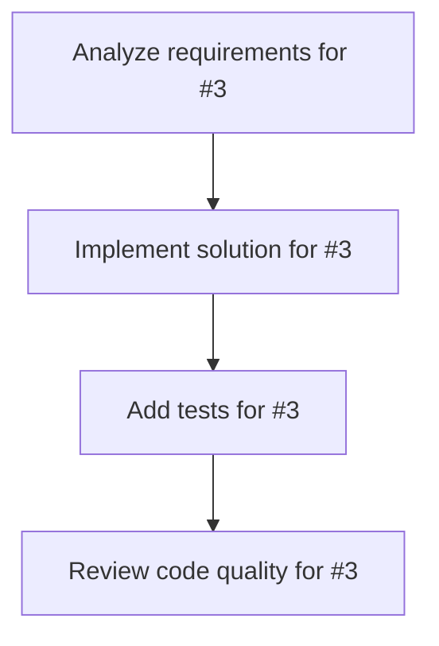

# Plans for Issue #3

**Title**: ユーザーから開発の指示を受けた時にすぐに開発着手しないで不明点があれば先に質問してから開発に着手するようにしてください

**URL**: https://github.com/shoma-endo/lark-bot-agent/issues/3

---

## 📋 Summary

- **Total Tasks**: 4
- **Estimated Duration**: 60 minutes
- **Execution Levels**: 4
- **Has Cycles**: ✅ No

## 📝 Task Breakdown

### 1. Analyze requirements for #3

- **ID**: `task-3-analysis`
- **Type**: Docs
- **Assigned Agent**: IssueAgent
- **Priority**: 0
- **Estimated Duration**: 5 min

**Description**: Analyze issue requirements and create detailed specification

### 2. Implement solution for #3

- **ID**: `task-3-impl`
- **Type**: Feature
- **Assigned Agent**: CodeGenAgent
- **Priority**: 1
- **Estimated Duration**: 30 min
- **Dependencies**: task-3-analysis

**Description**: ## 概要

ユーザーから開発指示を受けた際、すぐに開発に着手するのではなく、不明点があれば事前に質問で確認する機能を実装する。

## 要件

- 曖昧な指示を検知する
- 不明点を質問として生成する
- ユーザーの回答を待ってから開発を開始する

## 技術的考慮事項

- GLM-4.7を使用して質問を生成
- ジョブの状態管理（pending → questioning → development → completed）

### 3. Add tests for #3

- **ID**: `task-3-test`
- **Type**: Test
- **Assigned Agent**: CodeGenAgent
- **Priority**: 2
- **Estimated Duration**: 15 min
- **Dependencies**: task-3-impl

**Description**: Create comprehensive test coverage

### 4. Review code quality for #3

- **ID**: `task-3-review`
- **Type**: Refactor
- **Assigned Agent**: ReviewAgent
- **Priority**: 3
- **Estimated Duration**: 10 min
- **Dependencies**: task-3-test

**Description**: Run quality checks and code review

## 🔄 Execution Plan (DAG Levels)

Tasks can be executed in parallel within each level:

### Level 0 (Parallel Execution)

- `task-3-analysis` - Analyze requirements for #3

### Level 1 (Parallel Execution)

- `task-3-impl` - Implement solution for #3

### Level 2 (Parallel Execution)

- `task-3-test` - Add tests for #3

### Level 3 (Parallel Execution)

- `task-3-review` - Review code quality for #3

## 📊 Dependency Graph

## ⏱️ Timeline Estimation

- **Sequential Execution**: 60 minutes (1.0 hours)
- **Parallel Execution (Critical Path)**: 10 minutes (0.2 hours)
- **Estimated Speedup**: 6.0x

---

*Generated by CoordinatorAgent on 2026-01-16 22:53:26 UTC*
